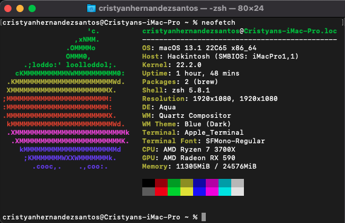
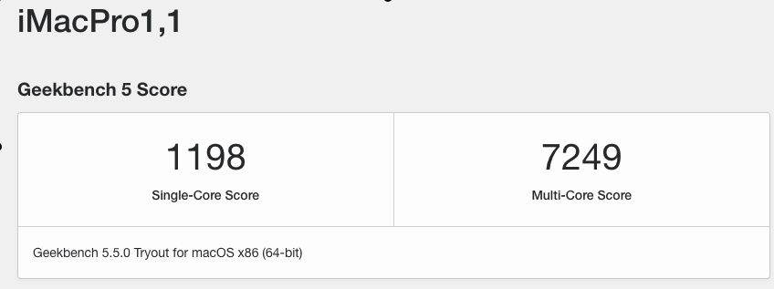

# AMD Ryzen Hackintosh - Opencore EFI for ASUS TUF GAMING B550

## Specification
| **Component** | **Model**                  |
| ------------- |----------------------------|
| CPU | AMD Ryzen 7 3700X @ 3.6GHz |
| Motherboard | ASUS TUF GAMING B550       |
| RAM | 24GB (3 x 8GB) DDR4-2400   |
| GPU | AMD Radeon RX 590 8GB      |
| Ethernet | RTL8125Ethernet 2.5Gb      |
| OS Disk (SATA) | SSD 256GB                  |

**macOS version**: 13.1

**OpenCore version**: 0.7.9

**SMBIOS**:  iMacPro1,1

**alcid**:  11

## Working
- Everything !

## Not working
 - None (No Wifi, No trouble)

## Known Issues
 - None

## How to use
  1. Create directory "EFI" in your EFI partition (e.g. pendrive or hard drive)
  2. Clone this repo and paste directiories "BOOT" and "OC" onto created directory
  3. Download [**GenSMBIOS**](https://github.com/corpnewt/GenSMBIOS) to generate unique SMBIOS information. Run it and select **Generate SMBIOS**, as model select **iMacPro1,1**.
  4. Open config.plist with [**ProperTree**](https://github.com/corpnewt/ProperTree) and go to PlatformInfo > Generic. Set MLB (Board Serial), SystemSerialNumber (Serial) and SystemUUID (SmUUID) to generated values.
  5. Boot it!  

## Credits

 * [jerryhan77](https://github.com/jerryhan77/asus-strix-b550-a-opencore)
 * [musfiqus](https://github.com/musfiqus/hackintosh-ROG-STRIX-B550A)
 * [huukhai](https://github.com/huukhai/hackintosh-rog-b550i)
 * [ikechan8370](https://github.com/ikechan8370/Asus-B550A-Opencore-EFI.git)
 * [RadeonSensor - Kext and Gadget to show Radeon GPU temperature on macOS](https://github.com/aluveitie/RadeonSensor)
 * [AMD Vanilla OpenCore](https://github.com/AMD-OSX/AMD_Vanilla)

## Disclaimer

This documentation is published for the sole purpose of learning and tech enthusiasm and with no guarantees of any kind, I’m not responsible of any harm of any kind or loss of data that may occur.
